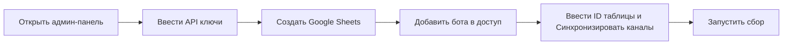

# NewsDigestApp Lite

**NewsDigestApp Lite** — 🎯 портативное Python-приложение для автоматического сбора, интеллектуальной фильтрации и публикации новостей из Twitter/X, YouTube и Telegram. Используйте Groq API и LLM для умного отбора контента и публикуйте готовые дайджесты в свой Telegram-канал.


---

## ✨ Возможности

**Умный сбор новостей** • **Гибкая фильтрация** • **Автопубликация** • **Простое управление**

| Платформа | Функции |
|-----------|---------|
| **Twitter/X** | Парсинг твитов, профилей, автоматический сбор постов |
| **YouTube** | Мониторинг каналов, сбор описаний видео |
| **Telegram** | Парсинг каналов и групп, аутентификация через код |
| **Google Sheets** | Централизованное управление источниками |

**Интеллектуальная фильтрация через LLM:**
- 🚫 Автоматическое определение рекламы и спама
- 📊 Оценка полезности новости по шкале 0.0-1.0
- ⏱️ Отсеивание устаревших публикаций
- 🎯 Фильтрация по заданной тематике

**Автоматическая публикация:**
- 📱 Единичная отправка после сбора
- 📅 Дневные, недельные и месячные дайджесты по расписанию
- 📝 Форматированный вывод с ссылками и оценками

**Удобное управление:**
- 🖥️ Веб-админ-панель с полным контролем
- 📋 Системный трей для быстрого доступа
- ⚙️ Настройка всех параметров через интерфейс
- 📊 Статистика и логирование в реальном времени

---

## 🚀 Быстрый старт

### Установка (Windows)

```powershell
# 1. Скачайте репозиторий и распакуйте
# 2. Запустите от имени администратора:
make_portable.ps1

# 3. Запустите приложение:
run.bat
```

### Настройка за 5 минут



1. **Откройте админ-панель** — она откроется автоматически в браузере (`http://localhost:5000`)
2. **Введите API ключи** в разделе Настройки. Ниже перечислены все необходимые параметры:

| Параметр | Описание | Где получить |
|----------|----------|--------------|
| `GROQ_API_KEY` | Ключ для работы с LLM | [Groq Console](https://console.groq.com) |
| `GOOGLE_SPREADSHEET_ID` | ID таблицы Google Sheets | Из URL таблицы |
| `TELEGRAM_BOT_TOKEN` | Токен Telegram-бота | @BotFather в Telegram |
| `TELEGRAM_CHANNEL_ID` | ID канала для публикации | @usernamebot или в настройках канала |
| `TELEGRAM_API_ID` | API ID для Telegram | [my.telegram.org/apps](https://my.telegram.org/apps) |
| `TELEGRAM_API_HASH` | API Hash для Telegram | [my.telegram.org/apps](https://my.telegram.org/apps) |
| `TELEGRAM_PHONE` | Номер телефона аккаунта | Ваш реальный номер |
| `TELEGRAM_2FA_PASSWORD` | Пароль 2FA (если включён) | Ваш пароль двухфакторной аутентификации |
| `TWITTER_BEARER_TOKEN` | Bearer Token для Twitter/X | [Twitter Developer Portal](https://developer.twitter.com) |
| `YOUTUBE_API_KEY` | API Key для YouTube | [Google Cloud Console](https://console.cloud.google.com) |
| `GOOGLE_SHEETS_CREDENTIALS_PATH` | Путь к credentials Google | Файл сервисного аккаунта |

3. **Создайте Google Sheets** с тремя листами: `X(Twitter)`, `Telegram`, `YouTube`
4. **Добавьте бота** `news-digest-bot@newsdigestapp-480206.iam.gserviceaccount.com` в доступ к таблице
5. **Нажмите «Синхронизировать»** на главном экране
6. **Запустите единичный проход** — приложение начнёт собирать новости

> 💡 **При первом запуске Telegram** может потребоваться ввести код аутентификации из Telegram в консольное окно приложения.

---

## 📋 Структура Google Sheets

Создайте таблицу с тремя листами. В первом столбце каждого листа укажите ссылки на каналы.

| Лист | Формат ссылок | Пример |
|------|---------------|--------|
| **X(Twitter)** | `https://x.com/username` | `https://x.com/claudeai` |
| **Telegram** | `https://t.me/username` | `https://t.me/maschinelearning` |
| **YouTube** | `https://www.youtube.com/@username` | `https://www.youtube.com/@pixaroma` |

---


## Конфигурация

Настраивается через админ-панель или файл `.env`.

### Настройки Google Sheets

```bash
# Путь к файлу credentials Google API
GOOGLE_SHEETS_CREDENTIALS_PATH=./data/credentials/google_credentials.json
# ID таблицы (из URL)
GOOGLE_SPREADSHEET_ID=id-таблицы
```

### Настройки Telegram

```bash
# Токен бота для публикации дайджестов
TELEGRAM_BOT_TOKEN=токен-бота
# ID канала для публикации (бот должен быть администратором)
TELEGRAM_CHANNEL_ID=@айди-канала
# Данные для аутентификации в Telegram API
TELEGRAM_API_ID=айди-апи
TELEGRAM_API_HASH=хеш-апи
TELEGRAM_PHONE=номер-телефона
TELEGRAM_2FA_PASSWORD=пароль-двухфакторной-авторизации
```

### Настройки Twitter/X

```bash
# Bearer Token для Twitter API
TWITTER_BEARER_TOKEN=твиттер-токен
```

### Настройки YouTube

```bash
# API Key для YouTube Data API
YOUTUBE_API_KEY=ютуб-апи-ключ
```

### Настройки Groq (LLM)

```bash
# API Key для Groq
GROQ_API_KEY=грок-апи-ключ
```

### Пользовательские настройки

```bash
# Метод обхода каналов при запуске:
# LOOP - цикличная работа, ONCE - единичный запуск, NONE - без запуска
BYPASSING_METHOD=NONE

# Порог полезности новости (0.000 - 0.999)
# Выше значение = строже фильтрация
INTEREST_THRESHOLD=0.53

# Максимальное количество новостей с канала за один проход
MAX_NEWS_PER_CHANNEL=6

# Максимальное количество новостей в одном дайджесте
MAX_NEWS_PER_DIGEST=6

# Максимальный возраст новостей в часах
MAX_NEWS_TIME_PERIOD=25

# Тип модели обработки (только LLM_API для Lite версии)
MODEL_TYPE=LLM_API

# Тематика для фильтрации LLM
TOPIC=Искусственный интеллект

# Интервалы опроса в секундах
TWITTER_INTERVAL=911       # Минимум 900 для бесплатного API
TELEGRAM_INTERVAL=8
YOUTUBE_INTERVAL=6

# Статус парсеров (TRUE/FALSE)
TWITTER_ACTIVE=FALSE
TELEGRAM_ACTIVE=TRUE
YOUTUBE_ACTIVE=TRUE

# Расписание дневного дайджеста (час, минута, включено)
DAILY_DIGEST={"hour":13,"minute":13,"enabled":false}

# Расписание недельного дайджеста
# Дни недели: mon, tue, wed, thu, fri, sat, sun
WEEKLY_DIGEST={"day_of_week":"tue","hour":14,"minute":14,"enabled":false}

# Расписание месячного дайджеста
MONTHLY_DIGEST={"day":15,"hour":15,"minute":15,"enabled":false}
```

### Системные настройки

```bash
# Путь к базе данных SQLite
DATABASE_PATH=./data/news.db

# Уровень логирования: DEBUG, INFO, WARNING, ERROR
LOG_LEVEL=INFO

# Часовой пояс для расписаний
TIMEZONE=Europe/Moscow

# Максимальное количество потоков
MAX_WORKERS=4

# Режим отладки
DEBUG=False

# Хост веб-сервера
WEB_HOST=0.0.0.0

# Порт веб-сервера
WEB_PORT=5000
```

---

## 🛠️ Технологический стек

**Backend:** Python 3.10.11+ • Flask • Quart • SQLAlchemy • APScheduler

**API & Парсинг:** Telethon • Tweepy • Google API Client • Groq SDK

**Инфраструктура:** SQLite • Hypercorn • python-dotenv • pystray

---

## 🖥️ Админ-панель и трей

| Элемент | Функция |
|---------|---------|
| **Главный экран** | Запуск цикла и прохода, синхронизация, статистика |
| **Каналы** | Просмотр, фильтрация, статистика|
| **Новости** | Просмотр, фильтрация, статистика |
| **Задачи** | Управление всеми запланированными задачами: цикличный опрос, дневной, недельный и месячный дайджесты, ручной запуск |
| **Логи** | INFO, WARNING и ERROR в реальном времени |
| **Настройки** | API ключи, параметры, промпты LLM |

**Системный трей:**
- 🟢 Открыть админ-панель
- 🔄 Включить/выключить автозапуск
- ❌ Закрыть приложение

---

## 📁 Структура проекта

```
news_digest_app_lite/
├── 📄 .env                     # Конфигурация приложения
├── 📄 .gitignore               # Исключения Git
├── 📄 main.py                  # Файл запуска только серверной части
├── 📄 make_portable.ps1        # Скрипт создания портативной версии
├── 📄 README.md                # Документация
├── 📄 requirements.txt         # Зависимости Python
├── 📄 run.bat                  # Batch-файл запуска
├── 📄 tray.py                  # Файл запуска полного приложения(сервер+трей)
├── 📂 .idea/                   # Настройки PyCharm/IDE
├── 📂 app/                     # Исходный код приложения
├── 📂 data/                    # Рабочие данные приложения
│   ├── 📂 credentials/         # Google API credentials
│   └── 📄 news.db              # SQLite база данных
└── 📂 python_dist/             # Портативная сборка Python
```

---

## 🐛 Поддержка и сообщения

- 📧 **Email:** feleti.dev@gmail.com
- 🐛 **Issues:** создавайте в репозитории GitHub


---

## Задачи на будущее

Мы постоянно работаем над улучшением NewsDigestApp Lite. Вот список запланированных функций и улучшений:

| Задача | Описание |
|--------|----------|
| **Чтение новостей из локального файла** | Возможность импортировать новости из локальных файлов различных форматов (TXT, JSON, CSV) для обработки и публикации |
| **Универсальный веб-парсер** | Добавление парсера любых веб-сайтов с автоматическим извлечением текста через LLM, что позволит мониторить источники без API |
| **Оптимизация использования RAM** | Улучшение управления памятью для снижения потребления ресурсов при длительной работе приложения |
| **Улучшение клиентской части** | Добавление спиннеров загрузки, анимаций, уведомлений и индикаторов прогресса для более отзывчивого интерфейса |
| **Активация и деактивация каналов** | Возможность временного отключения отдельных каналов без их удаления из базы и Google Sheets |
| **Устранение дубликатов** | Проверка на дублирование новостей перед добавлением в базу данных для исключения повторных публикаций |

---

## 📜 Лицензия

**GNU General Public License v3.0** — свободное использование, изучение и модификация.

---

<div align="center">

**Собрано с ❤️ для автоматизации новостей**

*NewsDigestApp Lite — ваш персональный агрегатор новостей*

</div>
